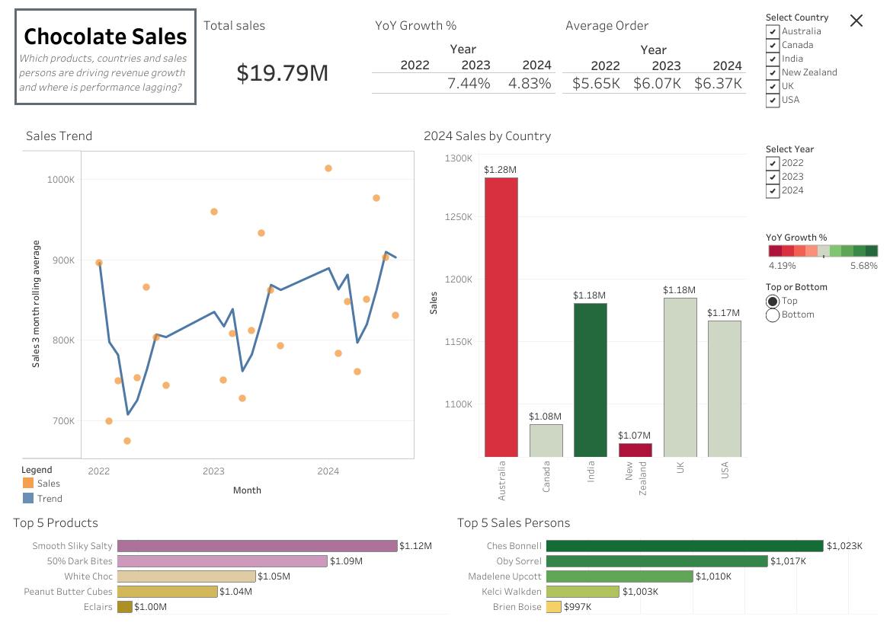

# Chocolate Sales — Business Intelligence for FMCG

[Link to this project on Tableau Public](https://public.tableau.com/views/chocolatesales_17709105308930/ChocolateSales?:language=en-GB&publish=yes&:sid=&:redirect=auth&:display_count=n&:origin=viz_share_link)

This project translated structured sales data into an **executive-facing performance dashboard** designed to answer a clear commercial question:
> Which products, regions and sales persons are driving revenue growth, and where is performance lagging?

The objective was not complexity, but a practical **decision-support tool** built in Tableau. 

The dashboard integrates

- revenue performance tracking
- year-on-year growth analysis
- average order value monitoring
- geographical comparison
- product and sales person contribution

## What’s in this repository

- **Jupyter Notebook:** full exploratory analysis (`Automobiles_Capstone_Project.ipynb`)  
- **Report:** formal written analysis and recommendations (`EDA_report_Automobile_Dataset.pdf`)  
- **Images:** visualisations and reviewer feedback  
- **Source data:** automobile dataset (`automobile.txt`)  
- **Requirements:** Python dependencies (`requirements.txt`)  

---

## Business Context

The dashboard simulates a mid-sized sales organisation seeking visibility over:

- growth trajectory
- country-level performance
- revenue concentration risk
- sales effectiveness

The KPIs used are structured to support operational decisions at executive level.

---

## Analytical Design

Although implemented in tableau, the structure reflects deliberate analytical choices:

- **Rolling 3-month averages** to smooth seasonal volatility
- Clear separation of **absolute performance** and **growth-rate metrics**
- Focused **Top/Bottom 5 rankings** to highlight material contributors
- Colour-coding to YoY growth to distinguish mature and expanding markets
- Consistent visual hierarchy for rapid executive scanning

---

## Key Insights / Findings

- Overall sales remain positive with sustained YoY growth
- Performance is **seasonal**, with minimal summer activity, but otherwise stable
- Revenue is concentrated in a small number of SKUs
- **India shows the strongest YoY growth**, indicating expansion potential
- **Australia and New Zealand show the lowest YoY growth**, suggesting mature markets
- Canada is a smaller market with performance concentrated in a single high-performing sales person, creating retention risk

---

## Strategic Implications

- Protect the mature markets in Australia and New Zealand, particularly high-revenue SKUs such as 50% Dark Bites
- Recognise and retain key sales contributors in concentrated markets (Canada)
- Prioritise investment and marketing campaigns in the high-growth Indian market
- Monitor product and sales person concentration risk

The emphasis is on translating performance metrics into actionable commercial direction.

---

## Extension opportunities

This dashboard could evolve through:

- time-series forecasting for seasonal and structural growth
- customer or regional segmentation analysis
- margin and cost integration for profitability tracking
- anomaly detection for underperforming territories
- automated refresh pipelines 

These extensions would move the product from descriptive BI toward predictive analytics.

---

## Skills Demonstrated

**Business Intelligence**
- executive dashboard design  
- KPI priroritisation and structuring
- interactive filtering  

**Analytical Thinking**
- trend smoothing and volatility assessment
- revenue concentration analysis
- market lifecycle interpretation

**Commercial Awareness**
- translating analytics into strategic recommendations 
- identifying operational and concentration risk  

**Tools**
- Tableau Public

---

## Data source
[Saidamin Saidakhmadov](https://www.kaggle.com/datasets/saidaminsaidaxmadov/chocolate-sales) contribution to Kaggle.

---

## Why this project belongs in my portfolio
This project demonstrates my ability to translate analytical outputs into structured, decision-oriented tools.

Rather than treating dashboard design as a visual exercise, I approached it with the same discipline applied in my analytical projects: clarifying the business question, prioritising material metrics, and structuring information to support sound judgement.

The work emphasises clarity, hierarchy, and interpretability — ensuring that performance data is not only presented, but framed in a way that supports real operational and strategic decisions. It complements my modelling projects by showing how analysis must ultimately be communicated, prioritised, and made usable within an organisational context.
